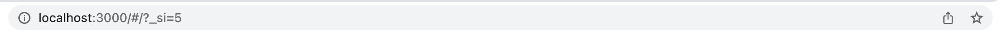

## Trouble shooting 1

karrotframe을 사용하기 위해서 CRA TypeScript 템플릿으로 프로젝트를 만들었습니다. 만들어진 프로젝트에 karrotframe의 navigator를 사용해보고 싶어서 [README]('https://github.com/daangn/karrotframe/tree/main/packages/navigator')에 적힌대로 `yarn add @karrotframe/navigator` 명령어를 이용해 설치하였습니다.

Navigator 컴포넌트를 import하여 사용해보니 이렇게 react-router-dom이 설치가 되어있지 않았다는 오류가 발생했습니다. 라우팅 관련 NPM 패키지여서 react-router-dom 패키지 설치가 필요했던 것 같아 바로 `yarn install react-router-dom` 명령어로 최신 버전 react-router-dom 패키지를 설치해버렸습니다.

이제 이전 에러는 해결했지만 이번에는 새로운 에러들이 발생했습니다. 에러 메시지를 읽어보니 새로 설치한 react-router-dom이 문제를 일으키고 있는 것을 알 수 있었습니다. useHistory 함수를 찾지 못했나봅니다. 최근 react-router-dom 최신 버전 6가 나오면서 생긴 문제일까 생각했습니다. 우선 구글에 에러 메시지를 검색해서 사례를 찾아보았습니다. 스택오버플로우를 보니 useHistory 함수가 이제 useNavigator로 바뀌어서 그런 에러가 나온다고 친절하게 알려주었습니다. 그래서 package.json에서 react-router-dom 버전을 낮춰주어서 karrotframes와 호환되도록 해야되도록 하였습니다. react-router-dom v5.3.2로 변경 후 `yarn install` 해주니 에러가 사라졌습니다!

## Trouble Shooting 2

Navigator 컴포넌트 안에 Screen 컴포넌트를 추가하고 component prop으로 제가 만든 HomeScreen 컴포넌트를 전달해주었으나 보이지 않았습니다.

이렇게 Navigator 컴포넌트를 추가하면 URL에 자동으로 `/#/?_si=2`이 추가되는데 이거를 없애도 계속 이 경로로 자동 리다이렉트 됩니다. 처음에는 저는 이것이 Screen path="/"를 지정하였음에도 보이지 않는 이유라고 생각했고 Screen path를 `/#/?_si=2`로 지정해보았습니다. 그래도 HomeScreen이 보이지 않았습니다.

문제가 해결되지 않아서 karrotframes 프로젝트에서 `_si`를 검색보았습니다 NavigatorSearchParams.ts 파일에서 SCREEN_INSTANCE_ID를 뜻한다는 것을 알 수 있었습니다.

여기에서 시간 상 navigator 사용을 멈추고 karrotframes의 tabs를 이용해보아야겠다고 생각했습니다.
